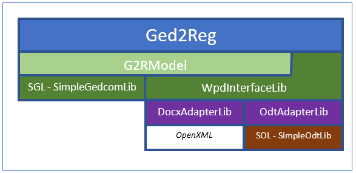

# Ged2Reg
Ged2Reg (“Gedcom-to-Register”) is a Windows desktop application that can be used to create readable (and editable) text output from a GEDCOM (Genealogical Data Communication) input file.  The GEDCOM input is a cryptic data interchange format that can be written and read by many genealogy applications.  The output word processing files (docx or odt) present selected content in one of two “standard” formats. The first of these is called Register Format, which was designed for effective communication of lineage (descendants) information to human readers and has long been used in major journals, such as those published by the NEHGS (New England Historic Genealogical Society). The second kind is an Ancestors Table (“Ahnentafel”).  

Both of these report conventions are probably familiar to most users who may be interested in Ged2Reg. They are commonly available as options in desktop genealogy applications.  Generally, however, those programs treat the report as a final product; further editing may be difficult or effectively impossible. In contrast, Ged2Reg assumes that the user will edit the output in a word processing application, for instance to make minor corrections, to add details not in the input database, to extend the text with hand-crafted family history narrative, or even to paste the entire output into another document as a chapter or section.  

Within Ged2Reg a user can easily build and save different configurations to produce different reports.

Source citations in Ged2Reg output can be emitted as footnotes or endnotes and can be as dense as one per fact. Ged2Reg offers a choice of strategies for choosing the "best" citations, filters to exclude some sources (such as, "never choose *Ancestry Public Member Trees* for a footnote"), and can optionally summarize the other sources for a given fact in its footnote.

# Status
Ged2Reg is under development and is made available in pre-realease or "beta" status.

Ged2Reg is designed for Windows 10 or later.  It has been reported to run on Windows 7, but this is not "supported" in any particular sense.

# To Build or Not to Build
The latest developer build and documentation are available for download here as a release. 

Ged2Reg is developed with Visual Studio 2019.  To build it yourself, open the solution file in the project root direction with Visual Studio 2019 or later, and Build / Rebuild all.

# Architecture

This simple block diagram conveys some key points about the architecture of Ged2Reg and its libraries (it does not show all dependencies). Note that, to avoid license conflicts and other dependencies, third party libraries are not used for the document file formats.  For docx files, the OpenXML system libraries are used. For odt files, an internal implementation of the file format is included in the project (SOL library); it is not a complete implementation, as it is limited to the features needed by Ged2Reg.  The component projects include
- Ged2Reg – Winforms application that provides the UI and control logic.
- G2RModel – library that provides a richer model of data from a GEDCOM file, and contains the reporting logic, to generate text from the selected data; also manages settings, inluding intialization and persistence.
- SGL (SimpleGedcomLib) – reads and parses a GEDCOM file and builds a low-level object model linking related tags such as families to spouses and children, sources to citations, etc.
- WpdInterfaceLib – provides an abstraction over word processing document (WPD) formats primarily for use by the model library; defines interfaces for document factory methods and documents.
- DocxAdapterLib – fully encapsulates (hides) all details of the docx file format needed in this application.
- OdtAdapterLib  – fully encapsulates (hides) all details of the odt file format needed in this application.
- CommonClassesLib (not shown) – provides a few template classes that are used in the UI, model, and other layers.

# Modifications
The author is not soliciting contributions from other developers at this time, though, if you believe you have found and fixed a bug you are welcome to post a suggestion.

The greatest barrier to efforts to make mods that alter the structure of the emitted text or add more GEDCOM event types to the output will be encountered in the rigidity of the reporting logic itself. 

The Register report format is itself rather rigidily specified, and as this was the original target of the program, the report logic is coded to it, rather than using a representation of sentence structure and grammar.

A 'hard fork' of the project, provisionally called Ged2Markup is in work privately. That version of the program includes an additional report type (list), an adapter library for an additional output type (wiki markup), configurable grammar and event selection, and an optional default configuration for output targeting WikiTree. A few hundred Wikitree profiles have been generated using Gedcom2Markup.  In the future it **may be** reincorporated into Ged2Reg or offered separately.

# License and Notice
Ged2Reg is offered free without warranty under the Apache Version 2.0 License. Prospective users must accept the License and also must acknowledge the Notice, which alerts the user to the fact that User is the author of any output they create with Ged2Reg, and that User must be aware of the potential for plagiarism, copyright violation, or other breach of the rights of third parties if their source data contains such (e.g., in notes or event description fields).
